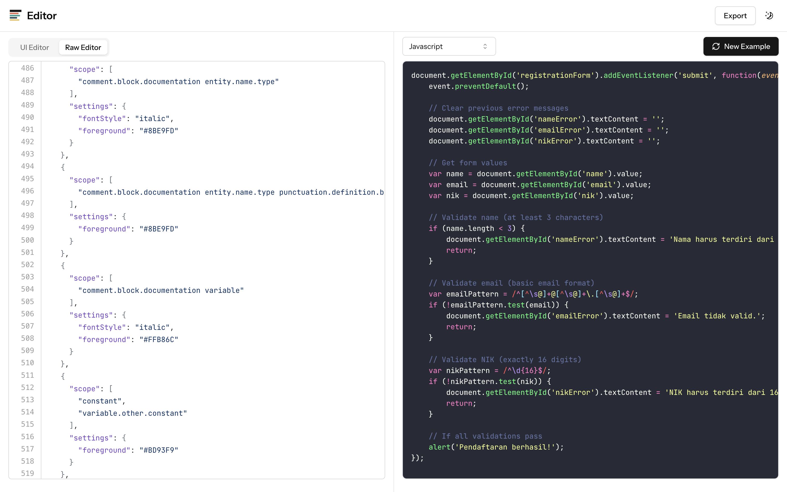

# TextMate Theme Editor

TextMate Theme Editor is a web-based editor for creating and customizing TextMate themes. It provides an intuitive interface for editing theme properties and previewing changes in real-time.

## Features

- Visual editor for customizing theme colors and styles
- Raw JSON editor for advanced customization
- Real-time preview of theme changes
- Import existing themes via URL
- Export themes in multiple formats

## Getting Started

To run the TextMate Theme Editor locally:

1. Clone the repository
2. Install dependencies with `npm install`
3. Start the development server with `npm run dev`
4. Open `http://localhost:3000` in your browser

## Usage

1. Use the visual editor to customize theme properties (coming soon)
2. Switch to the raw editor for advanced JSON editing
3. Preview your changes in real-time
4. Export your theme when finished

## Contributing

Contributions are welcome! Please feel free to submit a Pull Request.

## License

This project is licensed under the MIT License - see the LICENSE file for details.
